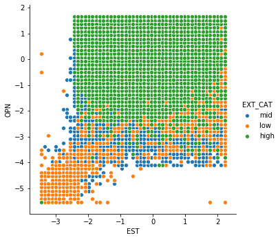

Data used in this analysis is the Big Five Personality Traits Survey data taken from Kaggle:
https://www.kaggle.com/tunguz/big-five-personality-test

It contains >1Mil responses from the personality survey taken online

This notebook contains some basic EDA for the big five dataset. In the course of the analysis, we form and test the hypothesis that people who score low on the train EXT, trend to score low on traits EST and OPN as well:

We perform factor analysis to reduce all questions to underlying factors, and explore any relations between different traits.